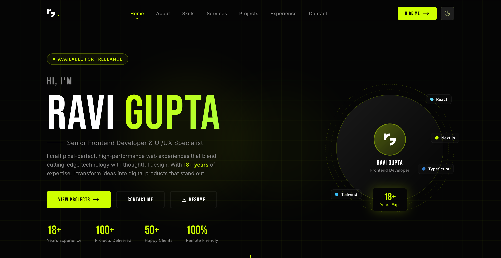

## rg
Full Stack Developer | Lead Web Designer | UI/UX Specialist | React.js, Next.js, Tailwind CSS Expert

## 🚀 Personal Portfolio

A modern and responsive personal portfolio built to showcase my work, skills, and creative journey as a Frontend Developer & UI/UX Designer. Crafted with a strong focus on clean design, smooth user experience, and high-performance web development.

This portfolio highlights my expertise in React.js, Next.js, TypeScript, Tailwind CSS, Bootstrap, HTML5, CSS3, and modern UI development. It includes featured projects, professional experience, technical skills, and ways to connect with me.

Designed with a minimalist dark theme, interactive animations, and fully responsive layouts to deliver a seamless experience across all devices.

## ✨ Features
- Modern & Minimal UI
- Fully Responsive Design
- Dark / Light Theme Switcher
- Smooth Animations & Transitions
- Project Showcase Section
- Skills & Experience Timeline
- Contact & Social Links
- Optimized Performance & SEO

## 🛠 Tech Stack
- Next.js
- React.js
- TypeScript
- Tailwind CSS
- Framer Motion
- HTML5 & CSS3

## 📌 Purpose

This portfolio is built to represent my professional identity, showcase selected work, and create meaningful opportunities for collaboration and freelance projects.

“Turning ideas into visually engaging and scalable digital experiences.”

---

## 📸 Screenshots

### Home Page


### Dashboard


### Mobile View


<p align="center">
	
</p>

---

## 🌐 Live Demo

Add your live project link here.

Example:

```bash
https://rg-portfolio-opal.vercel.app/
```

---

## 👨‍💻 Author

Developed by Ravi Gupta

- GitHub: https://github.com/officialRaviG
- Portfolio: https://officialravig.github.io/row-full/